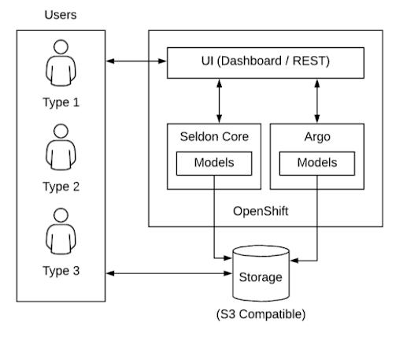
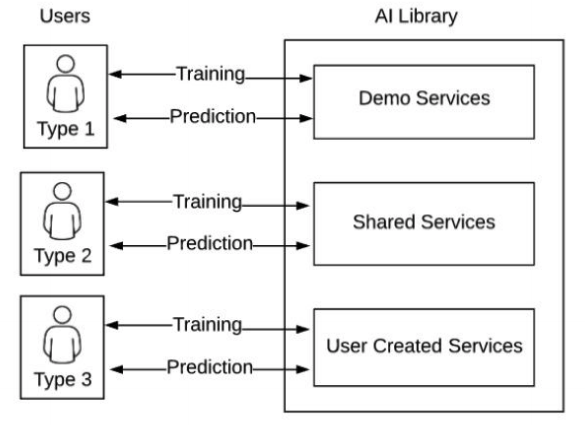

# AI Library

The AI Library is an open source collection of AI components machine learning algorithms and solutions to common use cases to allow rapid prototyping. To achieve this, it uses components of Open Data Hub, namely Seldon for serving, Argo workflows for automated training jobs and Ceph for storage. A more in depth look, you can read the [architecture document](http://opendatahub.io/assets/files/pages/docs/ai-lib-arch.pdf).

The number of services grows often. For an in depth look at the services, refer to the API. Currently, the available services include:

* Anomaly Detection
* Association Rule Learning
* Correlation Analysis
* Regression
* Flake Analysis
* Duplicate Bug Detection
* Fraud Detection
* Topic Modeling
* Matrix Factorization
* Sentiment Analysis

## AI Library Features

AI Library provides the following functionalities:

* Train existing machine learning models with sample training data provided with AI Library.
* Run prediction on sample data and pre-trained model provided with AI Library.
* Train existing machine learning models with user provided training data.
* Run prediction on user provided data through pre-trained models provided with AI Library.
* Run prediction on user provided data using custom trained models.
* Add new machine learning models for training and prediction and turn them into a service.

Basically there are three different actors that will interact differently with AI Library, let's check them.

**Demo Services**  
Demo services represent the examples presented through dashboard/GUI where users can run predictions using existing models and sample data provided with the system.

**Shared Services**
Shared services represent the usage of existing services with custom trained models and data. Users interact through REST apis to perform custom training and predictions.

**User Created Services**
Using existing models and services as templates, users can create custom models and turn them in to services, and run training/predictions on custom data.

## Next Steps

Our lab will be based on sentiment analysis using a pre-trained model provided with AI Library. We will also take a look on how to configure and deploy AI Library as part of the lab.